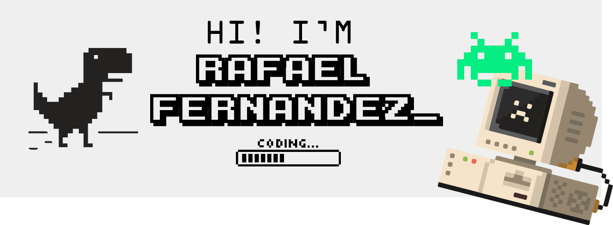

[](https://rafaelfernandezortiz.com/)

# Hello, folks! 

I'm a graduated in mathematics specialized in algebra and computer science, and a passionated Scala developer. As fascinated in learning about category theory as playing 80's arcade games. Looking for new challenges and new approaches to develop.

#### release 1.9.94

```scala
 import dev.myself.core._
  trait Person[F[_]] { /* compiled code */ }
  trait CurriculumVitae[F[_]] {
    def about: F[Info]
    def experience(date: Date): F[Info]
    def education(date: Date): F[Info]
    def techStacks: F[Stack]
  }

  def cv[F[_]: MonadFilter](person: Person[F]): CurriculumVitae[F] =
    new CurriculumVitae[F] {
      def about: F[Info] = person.MYLIFE
      def experience(date: Date): F[Info] = person.EXPERIENCE.filter(info => info.date == date)
      def education(date: Date): F[Info] = person.EDUCATION.filter(info => info.date == date)
      def techStacks: F[Stack] = person.SKILLS
    }

  val me: Person[List] = new Person[List] { /* compiled code */ }
  val rafaelFernandezOrtiz: CurriculumVitae[List] = cv(me)
```


## 🔧 Tech Stack


## Repos

[](https://github.com/rafafrdz/braids-and-cryptography) [](https://github.com/rafafrdz/g30Loc) 

[](https://github.com/rafafrdz/saddle) [](https://github.com/rafafrdz/practice-huffman-coding-algorithms)  